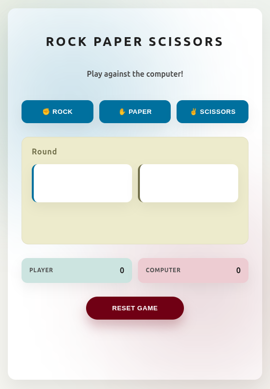

## 🔧 Tech Stack  


# Rock Paper Scissors – Web Game


A polished version of the classic **Rock–Paper–Scissors** game, redesigned with clean JavaScript structure, modular logic, and a fully refreshed visual style using CSS variables, gradients, and a centered card layout.

This project is part of **The Odin Project – Foundations Course**, originally built to learn **DOM manipulation**, **events**, and **game logic**.  

This updated version improves architecture, readability, and UI design.

---

## 🚀 Live Demo
Play the game here:

👉 **https://mariaingerslev.github.io/rock-paper-scissors-game/**

---

## 📸 Screenshot



---

## 🛠️ Technologies Used

- **HTML5**
- **CSS3**
- **JavaScript (Vanilla JS)**
- **Git & GitHub Pages**

---

## 🎮 Features

- Play against a computer opponent  
- First to **5 points** wins  
- Round-by-round display  
- Updated modern UI with gradients, shadows, and tokens  
- Scoreboard + round counter  
- Reset button  
- Fully responsive  

---

## 🔧 What I Improved in the New Version

### **🧠 1. Cleaner, More Structured JavaScript**
The game now uses a *proper architecture*:

- **Pure Logic**  
  - `getComputerChoice()`  
  - `getRoundResult()`  
- **State Object**  
  Holds scores, round, and gameOver flag.  
- **State Mutation**  
  - `applyRoundResult()` cleanly updates the state.  
- **Rendering Layer**  
  - `render()` updates DOM in one controlled place.
- **Controller**  
  - `playRound()` coordinates everything.
- **Separation of concerns**  
  Logic and UI are completely separated.

This is much easier to maintain and expand.

---

### **🎨 2. Full UI Redesign (HTML + CSS)**

- Added a centered **card container** (`.game-wrapper`)
- Added **CSS variables (tokens)** for:
  - colors  
  - spacing  
  - shadows  
  - radii  
- New layout:
  - Header  
  - Game buttons  
  - Result box  
  - Scoreboard  
  - Reset  
- Added gradient ambient glow using `::before`
- Prevented layout jumping with fixed heights
- Much cleaner, modern styling

---

## 📂 Project Structure
```bash
/rock–paper–scissor-game
│── index.html
│── style.css
│── main.js
│── README.md
└── images/
   └── rock-paper-scissors.png
```
---

## 📚 What I Learned

### **🌱 From the first version**
- Basic DOM selection  
- Event listeners  
- If/else logic for game rules  
- Updating textContent dynamically  
- Connecting JS → HTML → CSS  

### **🌿 From the updated version**
- Architecture patterns:
  - pure functions  
  - state + rendering separation  
  - controller pattern  
- Cleaner, reusable UI update logic  
- CSS variables (design tokens)  
- Using grid for layout  
- Centering and card-based UI  
- Avoiding layout shifts with min-heights  
- Branching, merging, Git workflow  

---

## ▶️ How to Run Locally


## ▶️ How to Run Locally

1. Clone the repository:
   ```bash
   git clone https://github.com/MariaIngerslev/rock-paper-scissors-game.git

2. cd rock-paper-scissors-game

3. Open index.html in your browser.