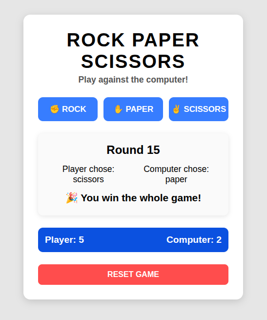

## 🔧 Tech Stack  


# Rock Paper Scissors – Web Game

A simple, interactive **Rock Paper Scissors** game built using **HTML, CSS, and JavaScript**.  
Play against the computer, track the score, and enjoy a clean UI design.

---

## 🚀 Live Demo
Play the game here:

👉 **https://mariaingerslev.github.io/rock-paper-scissors-game/**

---

## 📸 Screenshot



---

## 🎮 Features

- ✊ **Rock**, ✋ **Paper**, ✌️ **Scissors** gameplay  
- 🧠 Computer generates random choices  
- 🏆 First to **5 points** wins  
- 🔢 Displays round number and choices  
- 🎉 End-game message when someone wins  
- 🔄 Reset button to restart  
- 🎨 Clean layout with a centered *game-wrapper*

---

## 🛠️ Technologies Used

- **HTML5**
- **CSS3**
- **JavaScript (Vanilla JS)**

---

## 📂 Project Structure
```bash
/rock–paper–scissor-game
│── index.html
│── style.css
│── main.js
│── README.md
```

---

## ▶️ How to Run Locally

1. Clone the repository:
   ```bash
   git clone https://github.com/MariaIngerslev/rock-paper-scissors-game.git

2. cd rock-paper-scissors-game

3. Open index.html in your browser.

## 💬 About

This project is part of **The Odin Project – Foundations Course**.  
It was built to practice **JavaScript DOM manipulation**, event handling, and general front-end structure (HTML, CSS, and JS working together).

